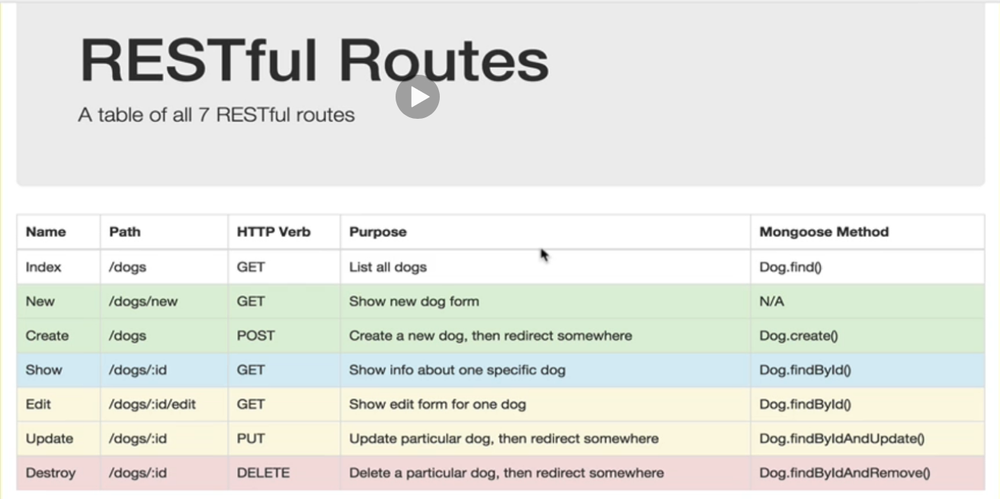

# Restful Routes

- "npm install express body-parers ejs mongoose --save"  
- PUT request is actually GET request.
  "npm install method-override --save"
- brew services start mongodb/brew/mongodb-community@4.2